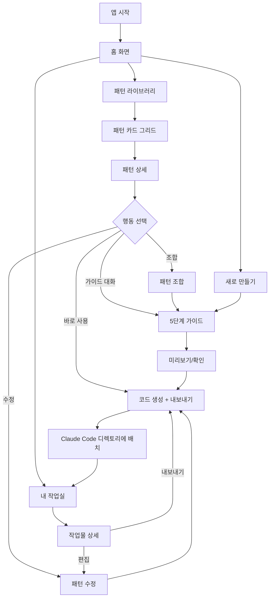

# SkillForge 사용자 플로우

## 1. 메인 플로우



## 2. 화면별 플로우

### 화면 1: 홈 화면
- **진입**: 앱 시작
- **행동**: 3가지 메뉴 선택 (패턴 라이브러리 / 내 작업실 / 새로 만들기)
- **이탈**: 선택한 메뉴로 이동

### 화면 2: 패턴 라이브러리
- **진입**: 홈 화면에서 "패턴 라이브러리" 선택
- **행동**:
  - 카드 그리드 탐색
  - 유형별 필터링 (스킬/에이전트/오케스트레이션)
  - 태그 검색
  - 카드 클릭으로 상세 진입
- **이탈**: 패턴 상세 / 홈으로 돌아가기

### 화면 3: 패턴 상세
- **진입**: 패턴 카드 클릭
- **행동**:
  - 패턴 구조 미리보기 (다이어그램)
  - 원본 마크다운 코드 보기
  - 수정해서 내 버전 만들기
  - 다른 패턴과 조합하기
  - 가이드 대화로 커스터마이즈
  - 바로 내보내기
- **이탈**: 가이드 대화 / 코드 생성 / 라이브러리로 돌아가기

### 화면 4: 가이드 대화 (5단계)
- **진입**: 패턴 상세에서 "가이드 대화" / "새로 만들기"에서 직접 진입
- **행동**:
  - Step 1: 유형/목적 정의
  - Step 2: 트리거 설계
  - Step 3: 구조 설계
  - Step 4: 도구/권한 설정
  - Step 5: 미리보기/확인
  - 각 단계에서 AI와 자유 대화로 상세화
- **이탈**: 미리보기 → 코드 생성

### 화면 5: 미리보기 + 코드 생성
- **진입**: 가이드 대화 Step 5
- **행동**:
  - 생성될 파일 구조 미리보기
  - 마크다운 내용 확인
  - 내보내기 경로 선택
  - Claude Code 디렉토리에 배치
- **이탈**: 내보내기 완료 → 내 작업실

### 화면 6: 내 작업실
- **진입**: 홈 화면에서 "내 작업실" / 내보내기 완료 후 자동 이동
- **행동**:
  - 만든/수정한 스킬/에이전트 목록 보기
  - 작업물 클릭으로 상세 진입
  - 편집/재내보내기
- **이탈**: 작업물 상세 / 홈으로 돌아가기

## 3. 핵심 시나리오

### 시나리오 1: 패턴 기반 스킬 생성
```
홈 → 패턴 라이브러리 → "코드 리뷰 스킬" 패턴 선택
→ 패턴 상세에서 구조 확인
→ "가이드 대화" 클릭
→ 5단계 대화로 내 프로젝트에 맞게 커스터마이즈
→ 미리보기에서 확인
→ .claude/skills/my-code-review/ 에 내보내기
→ 내 작업실에 이력 저장
```

### 시나리오 2: 처음부터 에이전트 만들기
```
홈 → 새로 만들기
→ "에이전트 만들기" 선택
→ 5단계 가이드 대화 시작
→ AI가 구조 제안, 대화하며 수정
→ 미리보기에서 확인
→ .claude/agents/my-agent.md 에 내보내기
```

### 시나리오 3: 기존 작업물 수정
```
홈 → 내 작업실
→ 이전에 만든 스킬 선택
→ 편집 모드에서 수정
→ 재내보내기로 Claude Code 업데이트
```
