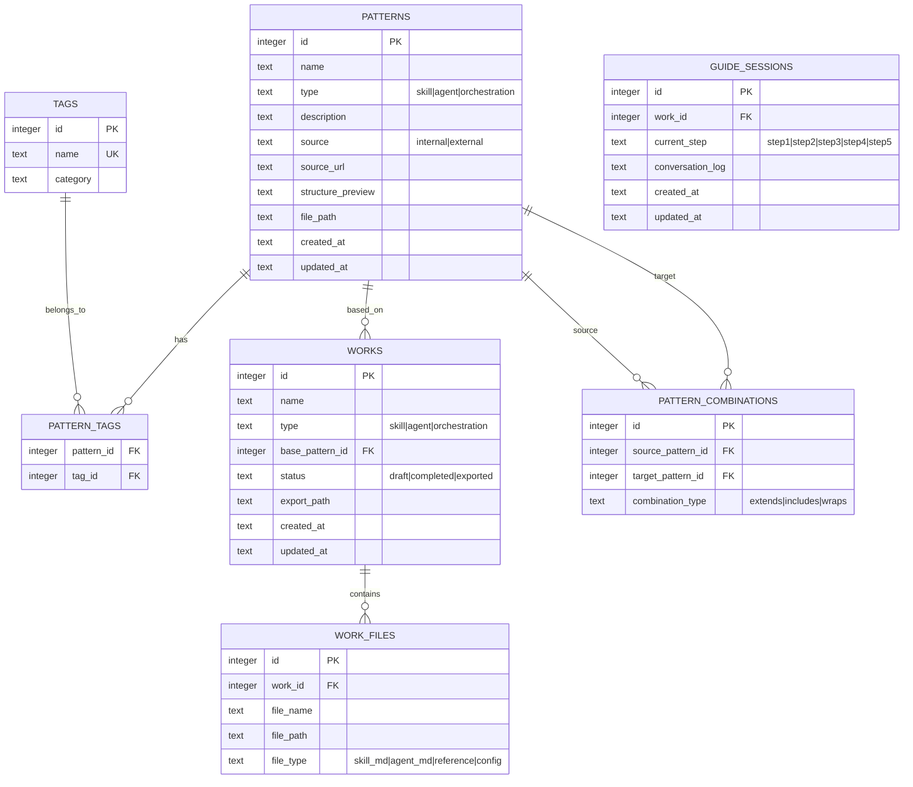

# SkillForge 데이터베이스 설계

## 1. ERD



## 2. 테이블 정의

### patterns (패턴)
| 컬럼 | 타입 | 제약 | 설명 |
|------|------|------|------|
| id | INTEGER | PK, AUTOINCREMENT | 기본키 |
| name | TEXT | NOT NULL | 패턴 이름 |
| type | TEXT | NOT NULL | 유형: skill, agent, orchestration |
| description | TEXT | | 패턴 설명 |
| source | TEXT | NOT NULL | 출처: internal(내 경험), external(외부) |
| source_url | TEXT | | 외부 출처 URL |
| structure_preview | TEXT | | 구조 미리보기 (마크다운/다이어그램) |
| file_path | TEXT | NOT NULL | 패턴 마크다운 파일 경로 |
| created_at | TEXT | DEFAULT CURRENT_TIMESTAMP | 생성일 |
| updated_at | TEXT | DEFAULT CURRENT_TIMESTAMP | 수정일 |

### tags (태그)
| 컬럼 | 타입 | 제약 | 설명 |
|------|------|------|------|
| id | INTEGER | PK, AUTOINCREMENT | 기본키 |
| name | TEXT | NOT NULL, UNIQUE | 태그 이름 |
| category | TEXT | | 태그 카테고리 |

### pattern_tags (패턴-태그 매핑)
| 컬럼 | 타입 | 제약 | 설명 |
|------|------|------|------|
| pattern_id | INTEGER | FK(patterns.id) | 패턴 ID |
| tag_id | INTEGER | FK(tags.id) | 태그 ID |

### works (작업물)
| 컬럼 | 타입 | 제약 | 설명 |
|------|------|------|------|
| id | INTEGER | PK, AUTOINCREMENT | 기본키 |
| name | TEXT | NOT NULL | 작업물 이름 |
| type | TEXT | NOT NULL | 유형: skill, agent, orchestration |
| base_pattern_id | INTEGER | FK(patterns.id), NULLABLE | 기반 패턴 ID |
| status | TEXT | DEFAULT 'draft' | 상태: draft, completed, exported |
| export_path | TEXT | | 내보내기 경로 |
| created_at | TEXT | DEFAULT CURRENT_TIMESTAMP | 생성일 |
| updated_at | TEXT | DEFAULT CURRENT_TIMESTAMP | 수정일 |

### work_files (작업물 파일)
| 컬럼 | 타입 | 제약 | 설명 |
|------|------|------|------|
| id | INTEGER | PK, AUTOINCREMENT | 기본키 |
| work_id | INTEGER | FK(works.id) | 작업물 ID |
| file_name | TEXT | NOT NULL | 파일 이름 |
| file_path | TEXT | NOT NULL | 파일 경로 |
| file_type | TEXT | NOT NULL | 파일 유형: skill_md, agent_md, reference, config |

### guide_sessions (가이드 대화 세션)
| 컬럼 | 타입 | 제약 | 설명 |
|------|------|------|------|
| id | INTEGER | PK, AUTOINCREMENT | 기본키 |
| work_id | INTEGER | FK(works.id) | 작업물 ID |
| current_step | TEXT | NOT NULL | 현재 단계 |
| conversation_log | TEXT | | 대화 기록 (JSON) |
| created_at | TEXT | DEFAULT CURRENT_TIMESTAMP | 생성일 |
| updated_at | TEXT | DEFAULT CURRENT_TIMESTAMP | 수정일 |

## 3. 인덱스

- `patterns.type` - 유형별 필터링
- `patterns.source` - 출처별 필터링
- `tags.name` - 태그 검색
- `works.status` - 상태별 필터링
- `works.type` - 유형별 필터링
- `pattern_tags(pattern_id, tag_id)` - 복합 인덱스

## 4. 파일 저장 구조

```
~/.skillforge/
├── db/
│   └── skillforge.db          # SQLite DB
├── patterns/
│   ├── skills/
│   │   ├── code-review/
│   │   │   ├── pattern.md     # 패턴 원본
│   │   │   └── preview.md     # 구조 미리보기
│   │   └── ...
│   ├── agents/
│   │   └── ...
│   └── orchestrations/
│       └── ...
└── works/
    ├── my-code-review-skill/
    │   ├── SKILL.md
    │   └── references/
    └── ...
```
