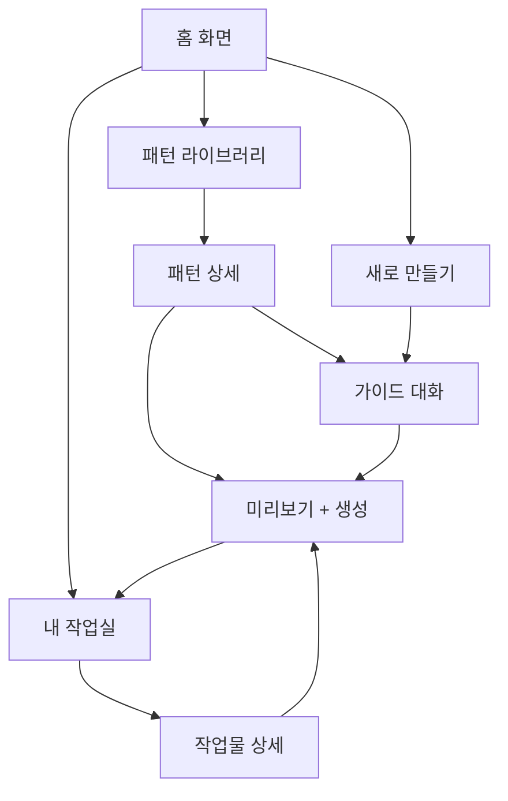

# SkillForge 화면 목록

## 화면 1: 홈 화면
- **ID**: screen-01-home
- **경로**: /
- **기능**: 앱 진입점, 3가지 메뉴 탐색
- **컴포넌트**:
  - 로고 + 앱 이름
  - 3개 메뉴 카드 (패턴 라이브러리, 내 작업실, 새로 만들기)
  - 최근 작업 미리보기 (선택)
  - 통계 요약 (패턴 수, 작업물 수)

## 화면 2: 패턴 라이브러리
- **ID**: screen-02-pattern-library
- **경로**: /patterns
- **기능**: 패턴 카드 그리드로 탐색, 검색, 필터링
- **컴포넌트**:
  - 검색바 (텍스트 입력 + 필터)
  - 유형 필터 탭 (전체/스킬/에이전트/오케스트레이션)
  - 태그 필터 칩
  - 패턴 카드 그리드 (이름 + 타입 뱃지 + 구조 미리보기 + 태그 + 설명)
  - 정렬 옵션 (최신순/이름순/유형별)

## 화면 3: 패턴 상세
- **ID**: screen-03-pattern-detail
- **경로**: /patterns/:id
- **기능**: 패턴 코드 보기, 수정, 조합, 가이드 대화 진입, 내보내기
- **컴포넌트**:
  - 패턴 정보 헤더 (이름, 타입, 설명, 태그)
  - 구조 미리보기 다이어그램
  - 마크다운 코드 에디터/뷰어
  - 액션 버튼 그룹:
    - "가이드 대화로 커스터마이즈" 버튼
    - "수정해서 내 버전 만들기" 버튼
    - "다른 패턴과 조합" 버튼
    - "바로 내보내기" 버튼
  - 관련 패턴 추천 (하단)

## 화면 4: 가이드 대화
- **ID**: screen-04-guide-dialogue
- **경로**: /guide/:workId
- **기능**: 5단계 하이브리드 대화로 스킬/에이전트 설계
- **컴포넌트**:
  - 5단계 스텝 인디케이터 (상단)
    - Step 1: 유형/목적 정의
    - Step 2: 트리거 설계
    - Step 3: 구조 설계
    - Step 4: 도구/권한 설정
    - Step 5: 미리보기/확인
  - 채팅 영역 (AI 버블 + 사용자 입력)
  - 사용자 입력 영역 (텍스트 + 선택지 옵션)
  - 현재 설계 상태 사이드 패널 (실시간 업데이트)
  - 이전/다음 단계 버튼

## 화면 5: 미리보기 + 코드 생성
- **ID**: screen-05-preview-generate
- **경로**: /guide/:workId/preview
- **기능**: 생성될 파일 미리보기, 확인, 내보내기 실행
- **컴포넌트**:
  - 파일 트리 미리보기 (왼쪽)
  - 파일 내용 미리보기/편집기 (오른쪽)
  - 내보내기 경로 선택기
    - 프로젝트 디렉토리 선택
    - `.claude/skills/` 또는 `.claude/agents/` 자동 감지
  - "내보내기" 버튼
  - "수정하기" 버튼 (가이드 대화로 돌아가기)

## 화면 6: 내 작업실
- **ID**: screen-06-my-workspace
- **경로**: /workspace
- **기능**: 생성/수정한 작업물 관리
- **컴포넌트**:
  - 작업물 목록 (카드 또는 리스트 뷰)
  - 상태 필터 (초안/완료/내보내기됨)
  - 유형 필터 (스킬/에이전트/오케스트레이션)
  - 검색
  - 작업물 카드: 이름 + 타입 + 상태 뱃지 + 기반 패턴 + 생성일

## 화면 7: 작업물 상세
- **ID**: screen-07-work-detail
- **경로**: /workspace/:id
- **기능**: 작업물 편집, 재내보내기
- **컴포넌트**:
  - 작업물 정보 헤더
  - 파일 트리 (왼쪽)
  - 마크다운 편집기 (오른쪽)
  - 액션 버튼: 편집 / 재내보내기 / 삭제
  - 내보내기 이력

---

## 화면 간 이동

---

## 공통 컴포넌트

- **사이드바 네비게이션**: 홈, 패턴 라이브러리, 내 작업실, 새로 만들기
- **브레드크럼**: 현재 위치 표시
- **토스트 알림**: 성공/에러 메시지
- **모달**: 확인 대화상자, 경로 선택
