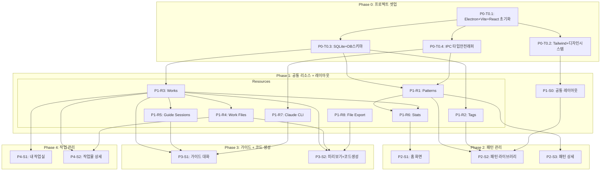

# SkillForge TASKS (v2.0 Domain-Guarded)

## 프로젝트 개요

- **앱**: SkillForge (Electron + React + TypeScript + Tailwind CSS)
- **설명**: Claude Code 스킬/에이전트/오케스트레이션 패턴 기반 빌더
- **모드**: Domain-Guarded (IPC Resource + Screen 분리)
- **데이터**: SQLite (better-sqlite3) + 로컬 파일 시스템
- **AI 연동**: Claude CLI (child_process 스트리밍)

## Interface Contract Validation

| Resource | Fields | Screens Using |
|----------|--------|---------------|
| patterns | 10/10 | pattern-library, pattern-detail, guide-dialogue |
| tags | 3/3 | pattern-library |
| works | 9/9 | guide-dialogue, preview-generate, workspace, work-detail |
| work_files | 4/4 | preview-generate, work-detail |
| guide_sessions | 4/4 | guide-dialogue |
| stats | 3/3 | home |

**결과**: 6 resources, 7 screens, **100% coverage** ✅

## 의존성 그래프

## 병렬 실행 그룹

| Phase | 그룹 | 태스크 | 병렬 |
|-------|------|--------|------|
| P0 | Setup | T0.1 | 단독 |
| P0 | Config | T0.2, T0.3, T0.4 | ✅ (T0.1 완료 후) |
| P1 | Resources A | R1, R2, R7, R8 | ✅ (독립) |
| P1 | Resources B | R3 | R1/R2와 병렬 가능 |
| P1 | Resources C | R4, R5 | ❌ (R3 완료 후) |
| P1 | Resources D | R6 | ❌ (R1+R3 완료 후) |
| P1 | Layout | S0 | T0.2 완료 후 (Resources와 병렬 가능) |
| P2 | Screens | S1, S2, S3 | S1→S2→S3 순차 |
| P3 | Screens | S1, S2 | S1→S2 순차 |
| P4 | Screens | S1, S2 | S1→S2 순차 |

---

# Phase 0: 프로젝트 셋업

### [ ] P0-T0.1: Electron + Vite + React + TypeScript 프로젝트 초기화
- **담당**: frontend-specialist
- **파일**: `package.json`, `vite.config.ts`, `tsconfig.json`, `electron-builder.yml`
- **스펙**: electron-vite 기반 프로젝트 스캐폴딩
  - Electron + Vite + React 18 + TypeScript 5
  - pnpm 패키지 매니저
  - electron/, src/ 디렉토리 구조 생성
  - 기본 Electron 창 (BrowserWindow) 열림 확인
- **TDD**: 앱 빌드 + 실행 확인
- **병렬**: 없음 (첫 태스크)

### [ ] P0-T0.2: Tailwind CSS + 디자인 시스템 설정
- **담당**: frontend-specialist
- **파일**: `tailwind.config.ts`, `src/styles/globals.css`
- **스펙**: 디자인 시스템 토큰 설정
  - 다크 테마: Background Slate #0F172A, Surface #1E293B
  - Primary Indigo #6366F1
  - 타입 뱃지 색상: Skill=#8B5CF6, Agent=#06B6D4, Orchestration=#F97316
  - 폰트: JetBrains Mono (코드), Inter (UI)
- **TDD**: Tailwind 클래스 렌더링 확인
- **의존**: P0-T0.1
- **병렬**: P0-T0.3, P0-T0.4와 병렬 가능

### [ ] P0-T0.3: SQLite 설정 + DB 스키마 생성
- **담당**: database-specialist
- **파일**: `electron/ipc/db.test.ts` → `electron/db/index.ts`, `electron/db/schema.sql`
- **스펙**: better-sqlite3 기반 DB 설정
  - 테이블: patterns, tags, pattern_tags, works, work_files, guide_sessions
  - 마이그레이션 시스템 (버전 관리)
  - DB 경로: `~/.skillforge/skillforge.db`
  - 초기 시드 데이터 (내장 패턴)
- **TDD**: RED → GREEN → REFACTOR
- **의존**: P0-T0.1
- **병렬**: P0-T0.2, P0-T0.4와 병렬 가능

### [ ] P0-T0.4: IPC 통신 타입 안전 래퍼 + Preload 설정
- **담당**: frontend-specialist
- **파일**: `electron/preload.ts`, `src/lib/ipc.test.ts` → `src/lib/ipc.ts`, `src/types/ipc.ts`
- **스펙**: Electron IPC 타입 안전 통신 설정
  - Preload script (contextBridge 노출)
  - IPC 채널 타입 정의 (요청/응답 타입)
  - Renderer 측 IPC 래퍼 (invoke/on 타입 안전)
  - 채널명 규칙: `도메인:액션` (예: `pattern:get-all`)
- **TDD**: RED → GREEN → REFACTOR
- **의존**: P0-T0.1
- **병렬**: P0-T0.2, P0-T0.3과 병렬 가능

---

# Phase 1: 공통 리소스 + 공통 레이아웃

## Resource 태스크 (Electron Main Process)

### P1-R1: Patterns Resource

#### [ ] P1-R1-T1: Patterns IPC 핸들러 구현
- **담당**: backend-specialist
- **리소스**: patterns
- **IPC 채널**:
  - `pattern:get-all` (목록 + 필터/검색/정렬)
  - `pattern:get-by-id` (상세)
  - `pattern:create` (생성)
  - `pattern:update` (수정)
  - `pattern:delete` (삭제)
  - `pattern:search` (전문 검색)
  - `pattern:get-related` (관련 패턴)
- **필드**: id, name, type, description, source, source_url, structure_preview, file_path, tags, created_at, updated_at
- **파일**: `electron/ipc/pattern.ipc.test.ts` → `electron/ipc/pattern.ipc.ts`
- **스펙**: 패턴 CRUD + 검색 + 파일 읽기 (마크다운 원본)
- **Worktree**: `worktree/phase-1-resources`
- **TDD**: RED → GREEN → REFACTOR
- **의존**: P0-T0.3, P0-T0.4
- **병렬**: P1-R2, P1-R3, P1-R7, P1-R8과 병렬 가능

### P1-R2: Tags Resource

#### [ ] P1-R2-T1: Tags IPC 핸들러 구현
- **담당**: backend-specialist
- **리소스**: tags
- **IPC 채널**:
  - `tag:get-all` (전체 태그 목록)
  - `tag:create` (태그 생성)
  - `tag:delete` (태그 삭제)
  - `tag:get-by-category` (카테고리별 태그)
- **필드**: id, name, category
- **파일**: `electron/ipc/tag.ipc.test.ts` → `electron/ipc/tag.ipc.ts`
- **스펙**: 태그 CRUD + pattern_tags 조인 관리
- **Worktree**: `worktree/phase-1-resources`
- **TDD**: RED → GREEN → REFACTOR
- **의존**: P0-T0.3, P0-T0.4
- **병렬**: P1-R1, P1-R3, P1-R7, P1-R8과 병렬 가능

### P1-R3: Works Resource

#### [ ] P1-R3-T1: Works IPC 핸들러 구현
- **담당**: backend-specialist
- **리소스**: works
- **IPC 채널**:
  - `work:get-all` (목록 + 상태/유형/검색 필터)
  - `work:get-by-id` (상세)
  - `work:create` (생성, base_pattern_id 선택)
  - `work:update` (수정, 상태 변경 포함)
  - `work:delete` (삭제 + 관련 파일/세션 cascade)
- **필드**: id, name, type, base_pattern_id, status, export_path, created_at, updated_at
- **파일**: `electron/ipc/work.ipc.test.ts` → `electron/ipc/work.ipc.ts`
- **스펙**: 작업물 CRUD + cascade 삭제 (work_files, guide_sessions 함께)
- **Worktree**: `worktree/phase-1-resources`
- **TDD**: RED → GREEN → REFACTOR
- **의존**: P0-T0.3, P0-T0.4
- **병렬**: P1-R1, P1-R2, P1-R7, P1-R8과 병렬 가능

### P1-R4: Work Files Resource

#### [ ] P1-R4-T1: Work Files IPC 핸들러 구현
- **담당**: backend-specialist
- **리소스**: work_files
- **IPC 채널**:
  - `work-file:get-by-work-id` (작업물별 파일 목록)
  - `work-file:create` (파일 메타데이터 + 파일 생성)
  - `work-file:update` (파일 내용 수정)
  - `work-file:delete` (파일 삭제)
  - `work-file:read-content` (파일 내용 읽기)
- **필드**: id, work_id, file_name, file_path, file_type
- **파일**: `electron/ipc/work-file.ipc.test.ts` → `electron/ipc/work-file.ipc.ts`
- **스펙**: 파일 메타데이터 CRUD + 실제 파일 시스템 읽기/쓰기
- **Worktree**: `worktree/phase-1-resources`
- **TDD**: RED → GREEN → REFACTOR
- **의존**: P1-R3
- **병렬**: P1-R5와 병렬 가능

### P1-R5: Guide Sessions Resource

#### [ ] P1-R5-T1: Guide Sessions IPC 핸들러 구현
- **담당**: backend-specialist
- **리소스**: guide_sessions
- **IPC 채널**:
  - `guide:get-by-work-id` (작업물별 세션 조회)
  - `guide:create` (새 세션 생성)
  - `guide:update-step` (현재 단계 변경)
  - `guide:add-message` (대화 메시지 추가)
  - `guide:get-conversation` (대화 기록 조회)
- **필드**: id, work_id, current_step, conversation_log, created_at, updated_at
- **파일**: `electron/ipc/guide.ipc.test.ts` → `electron/ipc/guide.ipc.ts`
- **스펙**: 가이드 세션 관리 + conversation_log JSON 저장/조회
- **Worktree**: `worktree/phase-1-resources`
- **TDD**: RED → GREEN → REFACTOR
- **의존**: P1-R3
- **병렬**: P1-R4와 병렬 가능

### P1-R6: Stats Resource

#### [ ] P1-R6-T1: Stats IPC 핸들러 구현
- **담당**: backend-specialist
- **리소스**: stats
- **IPC 채널**:
  - `stats:get-summary` (통계 요약: 패턴 수, 작업물 수, 최근 작업물 5개)
- **필드**: total_patterns, total_works, recent_works
- **파일**: `electron/ipc/stats.ipc.test.ts` → `electron/ipc/stats.ipc.ts`
- **스펙**: patterns + works 테이블 집계 쿼리
- **Worktree**: `worktree/phase-1-resources`
- **TDD**: RED → GREEN → REFACTOR
- **의존**: P1-R1, P1-R3
- **병렬**: 없음 (R1, R3 완료 후)

### P1-R7: Claude CLI Integration

#### [ ] P1-R7-T1: Claude CLI 스트리밍 래퍼 구현
- **담당**: backend-specialist
- **리소스**: claude_cli (외부 서비스)
- **IPC 채널**:
  - `claude:send-message` (메시지 전송 + 스트리밍 응답)
  - `claude:check-availability` (CLI 설치 확인)
  - `claude:abort` (진행 중인 요청 취소)
- **파일**: `electron/ipc/claude.ipc.test.ts` → `electron/ipc/claude.ipc.ts`
- **스펙**: child_process.spawn으로 Claude CLI 호출
  - 스트리밍 응답 (stdout 청크 단위 IPC 전달)
  - 시스템 프롬프트 주입 (가이드 단계별 컨텍스트)
  - 에러 핸들링 (CLI 미설치, 인증 만료 등)
  - 타임아웃 처리
- **Worktree**: `worktree/phase-1-resources`
- **TDD**: RED → GREEN → REFACTOR
- **의존**: P0-T0.4
- **병렬**: P1-R1, P1-R2, P1-R3, P1-R8과 병렬 가능

### P1-R8: File Export Service

#### [ ] P1-R8-T1: 파일 내보내기 서비스 구현
- **담당**: backend-specialist
- **리소스**: file_export (서비스)
- **IPC 채널**:
  - `file:export` (작업물 파일 → 지정 경로 내보내기)
  - `file:browse-directory` (디렉토리 선택 다이얼로그)
  - `file:detect-claude-dir` (.claude/ 디렉토리 자동 감지)
  - `file:validate-path` (경로 유효성 검증)
- **파일**: `electron/ipc/file.ipc.test.ts` → `electron/ipc/file.ipc.ts`
- **스펙**: 작업물 파일을 .claude/skills/ 또는 .claude/agents/에 내보내기
  - Electron dialog.showOpenDialog 연동
  - 파일 타입별 경로 자동 감지 (skill→skills/, agent→agents/)
  - 덮어쓰기 확인
- **Worktree**: `worktree/phase-1-resources`
- **TDD**: RED → GREEN → REFACTOR
- **의존**: P0-T0.4
- **병렬**: P1-R1, P1-R2, P1-R3, P1-R7과 병렬 가능

---

## Screen 태스크 (공통 레이아웃)

### P1-S0: 공통 레이아웃

#### [ ] P1-S0-T1: 공통 레이아웃 + 공유 컴포넌트 구현
- **담당**: frontend-specialist
- **화면**: 전체 (모든 화면에서 사용)
- **컴포넌트**:
  - SidebarNav (앱 전역 사이드바: 홈, 패턴 라이브러리, 내 작업실, 새로 만들기)
  - Breadcrumb (현재 위치 표시)
  - Toast (성공/에러/정보 알림)
  - TypeBadge (스킬=보라, 에이전트=시안, 오케스트레이션=오렌지)
  - StatusBadge (초안=회색, 완료=녹색, 내보내기됨=파란색)
  - ExportPathPicker (내보내기 경로 선택 모달)
  - AppLayout (sidebar-main / full-width 레이아웃 래퍼)
- **파일**: `src/components/ui/*.test.tsx` → `src/components/ui/*.tsx`, `src/components/layout/*.tsx`
- **스펙**: 공유 컴포넌트 라이브러리 + React Router DOM 라우팅 설정
- **Worktree**: `worktree/phase-1-layout`
- **TDD**: RED → GREEN → REFACTOR
- **의존**: P0-T0.2
- **병렬**: P1 Resource 태스크와 병렬 가능

---

# Phase 2: 패턴 관리

> 데이터 요구: patterns, tags, stats

### P2-S1: 홈 화면

#### [ ] P2-S1-T1: 홈 화면 UI 구현
- **담당**: frontend-specialist
- **화면**: /
- **컴포넌트**:
  - AppHeader (로고 + 앱 이름)
  - MenuCards (3개 메인 메뉴 카드: 패턴 라이브러리, 내 작업실, 새로 만들기)
  - RecentWorks (최근 작업물 5개 리스트)
  - StatsSummary (패턴 수, 작업물 수)
- **데이터 요구**: stats (data_requirements 참조)
- **스토어**: `src/stores/statsStore.ts` (useStats 훅)
- **파일**: `src/pages/Home.test.tsx` → `src/pages/Home.tsx`, `src/hooks/useStats.ts`
- **스펙**: 앱 시작 화면, 3개 메뉴 카드 + 통계 + 최근 작업
- **Worktree**: `worktree/phase-2-patterns`
- **TDD**: RED → GREEN → REFACTOR
- **데모 상태**: loading, normal, empty (작업물 없음)
- **의존**: P1-S0, P1-R6

#### [ ] P2-S1-T2: 홈 화면 통합 테스트
- **담당**: test-specialist
- **화면**: /
- **시나리오**:
  | 이름 | When | Then |
  |------|------|------|
  | 초기 로드 | 앱 시작 | 3개 메뉴 카드 표시, 통계 표시 |
  | 패턴 라이브러리 이동 | 카드 클릭 | /patterns로 이동 |
  | 최근 작업 이동 | 항목 클릭 | /workspace/:id로 이동 |
- **파일**: `src/pages/Home.integration.test.tsx`
- **Worktree**: `worktree/phase-2-patterns`

#### [ ] P2-S1-V: 홈 화면 연결점 검증
- **담당**: test-specialist
- **화면**: /
- **검증 항목**:
  - [ ] Field Coverage: stats.[total_patterns, total_works, recent_works] 존재
  - [ ] IPC: `stats:get-summary` 응답 정상
  - [ ] Navigation: MenuCards → /patterns 라우트 존재
  - [ ] Navigation: MenuCards → /workspace 라우트 존재
  - [ ] Navigation: MenuCards → /guide/new 라우트 존재
  - [ ] Navigation: RecentWorks → /workspace/:id 라우트 존재

---

### P2-S2: 패턴 라이브러리 화면

#### [ ] P2-S2-T1: 패턴 라이브러리 UI 구현
- **담당**: frontend-specialist
- **화면**: /patterns
- **컴포넌트**:
  - SearchBar (패턴 이름/설명 검색)
  - TypeFilter (탭: 전체/스킬/에이전트/오케스트레이션)
  - TagFilter (태그 칩 필터)
  - PatternGrid (패턴 카드 그리드)
  - PatternCard (이름 + 타입 뱃지 + 설명 + 구조 미리보기 + 태그)
- **데이터 요구**: patterns, tags (data_requirements 참조)
- **스토어**: `src/stores/patternStore.ts` (usePatterns 훅)
- **파일**: `src/pages/PatternLibrary.test.tsx` → `src/pages/PatternLibrary.tsx`, `src/components/patterns/PatternCard.tsx`, `src/components/patterns/PatternGrid.tsx`, `src/hooks/usePatterns.ts`
- **스펙**: 패턴 카드 그리드 + 유형/태그/검색 필터 + URL 쿼리 파라미터 동기화
- **Worktree**: `worktree/phase-2-patterns`
- **TDD**: RED → GREEN → REFACTOR
- **데모 상태**: loading, normal, empty (검색 결과 없음), filtered
- **의존**: P1-S0, P1-R1, P1-R2

#### [ ] P2-S2-T2: 패턴 라이브러리 통합 테스트
- **담당**: test-specialist
- **화면**: /patterns
- **시나리오**:
  | 이름 | When | Then |
  |------|------|------|
  | 초기 로드 | 페이지 접속 | 전체 패턴 그리드, 유형 탭 (전체 활성) |
  | 유형 필터 | "에이전트" 탭 클릭 | URL ?type=agent, 에이전트만 표시 |
  | 검색 | "코드 리뷰" 입력 | 해당 패턴만 표시 |
  | 상세 이동 | 카드 클릭 | /patterns/:id로 이동 |
- **파일**: `src/pages/PatternLibrary.integration.test.tsx`
- **Worktree**: `worktree/phase-2-patterns`

#### [ ] P2-S2-V: 패턴 라이브러리 연결점 검증
- **담당**: test-specialist
- **화면**: /patterns
- **검증 항목**:
  - [ ] Field Coverage: patterns.[id, name, type, description, structure_preview, tags] 존재
  - [ ] Field Coverage: tags.[id, name, category] 존재
  - [ ] IPC: `pattern:get-all` 응답 정상 (필터 포함)
  - [ ] IPC: `tag:get-all` 응답 정상
  - [ ] Navigation: PatternGrid → /patterns/:id 라우트 존재
  - [ ] Shared: SidebarNav 렌더링 + 링크 유효성
  - [ ] Shared: Breadcrumb 렌더링

---

### P2-S3: 패턴 상세 화면

#### [ ] P2-S3-T1: 패턴 상세 UI 구현
- **담당**: frontend-specialist
- **화면**: /patterns/:id
- **컴포넌트**:
  - PatternHeader (이름, 타입 뱃지, 설명, 태그, 출처)
  - StructurePreview (구조 미리보기 다이어그램, 마크다운 렌더링)
  - CodeViewer (마크다운 원본 코드 보기/편집)
  - ActionButtons (가이드 대화, 포크, 조합, 바로 내보내기)
  - RelatedPatterns (관련 패턴 추천 목록, 사이드바)
  - ExportModal (내보내기 경로 선택 대화상자)
- **데이터 요구**: patterns (detail + related)
- **파일**: `src/pages/PatternDetail.test.tsx` → `src/pages/PatternDetail.tsx`, `src/components/patterns/PatternDetail.tsx`, `src/components/patterns/StructurePreview.tsx`, `src/components/editor/CodeViewer.tsx`
- **스펙**: 패턴 상세 보기 + 4개 액션 + 관련 패턴 + 내보내기 모달
- **Worktree**: `worktree/phase-2-patterns`
- **TDD**: RED → GREEN → REFACTOR
- **데모 상태**: loading, normal, editing, exporting
- **의존**: P2-S2, P1-R1, P1-R8

#### [ ] P2-S3-T2: 패턴 상세 통합 테스트
- **담당**: test-specialist
- **화면**: /patterns/:id
- **시나리오**:
  | 이름 | When | Then |
  |------|------|------|
  | 초기 로드 | 페이지 접속 | 정보 헤더, 구조 미리보기, 코드, 액션 4개 |
  | 가이드 시작 | "가이드 대화" 클릭 | 작업물 생성 + /guide/:workId 이동 |
  | 바로 내보내기 | "바로 내보내기" 클릭 | 경로 선택 모달 → 파일 생성 → 토스트 |
- **파일**: `src/pages/PatternDetail.integration.test.tsx`
- **Worktree**: `worktree/phase-2-patterns`

#### [ ] P2-S3-V: 패턴 상세 연결점 검증
- **담당**: test-specialist
- **화면**: /patterns/:id
- **검증 항목**:
  - [ ] Field Coverage: patterns.[id, name, type, description, source, source_url, structure_preview, file_path, tags] 존재
  - [ ] IPC: `pattern:get-by-id` 응답 정상
  - [ ] IPC: `pattern:get-related` 응답 정상
  - [ ] IPC: `file:export` 동작 정상
  - [ ] Navigation: ActionButtons → /guide/:workId 라우트 존재
  - [ ] Navigation: RelatedPatterns → /patterns/:id 라우트 존재
  - [ ] Shared: Toast 알림 동작

---

# Phase 3: 가이드 + 코드 생성

> 데이터 요구: works, guide_sessions, patterns, work_files, claude_cli, file_export

### P3-S1: 가이드 대화 화면

#### [ ] P3-S1-T1: 가이드 대화 UI 구현
- **담당**: frontend-specialist
- **화면**: /guide/:workId
- **컴포넌트**:
  - StepIndicator (5단계 스테퍼: 유형/목적 → 트리거 → 구조 → 도구/권한 → 미리보기)
  - ChatArea (AI + 사용자 메시지 버블, 스크롤, 스트리밍 표시)
  - UserInput (텍스트 입력 + 선택지 옵션 버튼)
  - DesignStatePanel (사이드바: 현재 설계 상태 실시간 누적)
  - BasePatternInfo (사이드바: 기반 패턴 정보, 있는 경우만)
  - StepNavButtons (이전/다음 단계 이동)
- **데이터 요구**: works, guide_sessions, patterns (data_requirements 참조)
- **스토어**: `src/stores/guideStore.ts` (useGuide 훅)
- **파일**: `src/pages/GuideDialogue.test.tsx` → `src/pages/GuideDialogue.tsx`, `src/components/guide/GuideChat.tsx`, `src/components/guide/StepIndicator.tsx`, `src/components/guide/ChatBubble.tsx`, `src/components/guide/DesignStatePanel.tsx`, `src/hooks/useGuide.ts`, `src/hooks/useClaude.ts`
- **스펙**: 5단계 하이브리드 가이드 (단계별 구조 + AI 대화)
  - Claude CLI 스트리밍 응답 표시
  - 단계별 시스템 프롬프트 주입
  - 설계 상태 실시간 누적 (사이드바)
  - 패턴 기반 시작 vs 새로 만들기 분기
- **Worktree**: `worktree/phase-3-guide`
- **TDD**: RED → GREEN → REFACTOR
- **데모 상태**: loading, chatting (streaming), step-transition, pattern-based, new-start
- **의존**: P1-S0, P1-R3, P1-R5, P1-R7

#### [ ] P3-S1-T2: 가이드 대화 통합 테스트
- **담당**: test-specialist
- **화면**: /guide/:workId
- **시나리오**:
  | 이름 | When | Then |
  |------|------|------|
  | 패턴 기반 시작 | 패턴에서 진입 | 스텝 1 활성, 기반 패턴 표시, AI 첫 질문 |
  | 새로 만들기 | 새로 만들기 진입 | 스텝 1 활성, 유형 선택 질문 |
  | AI 대화 | 메시지 전송 | CLI 호출, 스트리밍 응답, 설계 상태 업데이트 |
  | 단계 이동 | "다음 단계" 클릭 | 현재 단계 완료, 다음 단계 전환 |
  | 미리보기 진입 | Step 5 완료 | /guide/:workId/preview 이동 |
- **파일**: `src/pages/GuideDialogue.integration.test.tsx`
- **Worktree**: `worktree/phase-3-guide`

#### [ ] P3-S1-V: 가이드 대화 연결점 검증
- **담당**: test-specialist
- **화면**: /guide/:workId
- **검증 항목**:
  - [ ] Field Coverage: works.[id, name, type, base_pattern_id, status] 존재
  - [ ] Field Coverage: guide_sessions.[id, work_id, current_step, conversation_log] 존재
  - [ ] Field Coverage: patterns.[id, name, type, structure_preview] 존재
  - [ ] IPC: `work:get-by-id` 응답 정상
  - [ ] IPC: `guide:get-by-work-id` 응답 정상
  - [ ] IPC: `claude:send-message` 스트리밍 동작
  - [ ] IPC: `claude:check-availability` CLI 확인
  - [ ] Navigation: StepIndicator → /guide/:workId/preview 라우트 존재
  - [ ] External: Claude CLI 연결 정상

---

### P3-S2: 미리보기 + 코드 생성 화면

#### [ ] P3-S2-T1: 미리보기 + 코드 생성 UI 구현
- **담당**: frontend-specialist
- **화면**: /guide/:workId/preview
- **컴포넌트**:
  - FileTree (사이드바: 생성될 파일 트리 구조)
  - FileEditor (마크다운 편집기 + 구문 하이라이팅)
  - ExportConfig (내보내기 경로 설정 폼)
  - ActionButtons (내보내기 / 수정하기)
- **데이터 요구**: works, work_files (data_requirements 참조)
- **파일**: `src/pages/Preview.test.tsx` → `src/pages/Preview.tsx`, `src/components/editor/FileTree.tsx`, `src/components/editor/MarkdownEditor.tsx`
- **스펙**: 생성된 파일 미리보기 + 편집 + .claude/ 디렉토리 내보내기
  - 파일 트리 네비게이션
  - 마크다운 편집기 (실시간 미리보기)
  - 내보내기 경로 자동 감지 (.claude/skills/ 또는 .claude/agents/)
  - 내보내기 후 상태 변경 (exported)
- **Worktree**: `worktree/phase-3-guide`
- **TDD**: RED → GREEN → REFACTOR
- **데모 상태**: loading, previewing, editing, exporting, exported
- **의존**: P3-S1, P1-R3, P1-R4, P1-R8

#### [ ] P3-S2-T2: 미리보기 + 코드 생성 통합 테스트
- **담당**: test-specialist
- **화면**: /guide/:workId/preview
- **시나리오**:
  | 이름 | When | Then |
  |------|------|------|
  | 초기 로드 | 페이지 접속 | 파일 트리, 첫 파일 에디터, 경로 기본값 |
  | 파일 편집 | 에디터에서 수정 | 실시간 반영, 저장 표시 |
  | 내보내기 | "내보내기" 클릭 | 파일 생성 → 토스트 → exported 상태 |
- **파일**: `src/pages/Preview.integration.test.tsx`
- **Worktree**: `worktree/phase-3-guide`

#### [ ] P3-S2-V: 미리보기 + 코드 생성 연결점 검증
- **담당**: test-specialist
- **화면**: /guide/:workId/preview
- **검증 항목**:
  - [ ] Field Coverage: works.[id, name, type, status] 존재
  - [ ] Field Coverage: work_files.[id, file_name, file_path, file_type] 존재
  - [ ] IPC: `work:get-by-id` 응답 정상
  - [ ] IPC: `work-file:get-by-work-id` 응답 정상
  - [ ] IPC: `work-file:read-content` 파일 내용 정상
  - [ ] IPC: `file:export` 내보내기 동작 정상
  - [ ] IPC: `file:browse-directory` 다이얼로그 동작
  - [ ] Navigation: ActionButtons → /guide/:workId 라우트 존재
  - [ ] Navigation: ActionButtons → /workspace 라우트 존재
  - [ ] Shared: Toast 알림 동작

---

# Phase 4: 작업 관리

> 데이터 요구: works, work_files

### P4-S1: 내 작업실 화면

#### [ ] P4-S1-T1: 내 작업실 UI 구현
- **담당**: frontend-specialist
- **화면**: /workspace
- **컴포넌트**:
  - StatusFilter (탭: 전체/초안/완료/내보내기됨)
  - TypeFilter (유형 필터: 스킬/에이전트/오케스트레이션)
  - SearchBar (작업물 이름 검색)
  - WorkGrid (작업물 카드 그리드)
  - WorkCard (이름 + 타입 뱃지 + 상태 뱃지 + 기반 패턴 + 날짜)
- **데이터 요구**: works (data_requirements 참조)
- **스토어**: `src/stores/workStore.ts` (useWorks 훅)
- **파일**: `src/pages/Workspace.test.tsx` → `src/pages/Workspace.tsx`, `src/components/workspace/WorkCard.tsx`, `src/components/workspace/WorkGrid.tsx`, `src/hooks/useWorks.ts`
- **스펙**: 작업물 카드 그리드 + 상태/유형/검색 필터 + URL 쿼리 동기화
- **Worktree**: `worktree/phase-4-workspace`
- **TDD**: RED → GREEN → REFACTOR
- **데모 상태**: loading, normal, empty, filtered
- **의존**: P1-S0, P1-R3

#### [ ] P4-S1-T2: 내 작업실 통합 테스트
- **담당**: test-specialist
- **화면**: /workspace
- **시나리오**:
  | 이름 | When | Then |
  |------|------|------|
  | 초기 로드 | 페이지 접속 | 전체 작업물 그리드, 상태 탭 (전체 활성) |
  | 상태 필터 | "내보내기됨" 탭 | URL ?status=exported, 해당 작업물만 |
  | 상세 이동 | 카드 클릭 | /workspace/:id로 이동 |
- **파일**: `src/pages/Workspace.integration.test.tsx`
- **Worktree**: `worktree/phase-4-workspace`

#### [ ] P4-S1-V: 내 작업실 연결점 검증
- **담당**: test-specialist
- **화면**: /workspace
- **검증 항목**:
  - [ ] Field Coverage: works.[id, name, type, base_pattern_id, status, export_path, created_at, updated_at] 존재
  - [ ] IPC: `work:get-all` 응답 정상 (필터 포함)
  - [ ] Navigation: WorkGrid → /workspace/:id 라우트 존재
  - [ ] Shared: SidebarNav 렌더링
  - [ ] Shared: Breadcrumb 렌더링

---

### P4-S2: 작업물 상세 화면

#### [ ] P4-S2-T1: 작업물 상세 UI 구현
- **담당**: frontend-specialist
- **화면**: /workspace/:id
- **컴포넌트**:
  - WorkHeader (이름, 타입, 상태, 기반 패턴, 날짜)
  - FileTree (작업물 파일 트리, 사이드바)
  - MarkdownEditor (마크다운 편집기, 실시간 미리보기)
  - ActionButtons (편집 / 재내보내기 / 삭제)
  - ExportHistory (내보내기 이력, 사이드바)
  - DeleteModal (삭제 확인 대화상자)
- **데이터 요구**: works, work_files (data_requirements 참조)
- **파일**: `src/pages/WorkDetail.test.tsx` → `src/pages/WorkDetail.tsx`
- **스펙**: 작업물 상세 보기 + 파일 편집 + 재내보내기 + 삭제
  - 파일 트리 네비게이션
  - 마크다운 편집 + 로컬 파일 저장
  - 재내보내기 (경로 재선택)
  - 삭제 확인 모달 + cascade 삭제
- **Worktree**: `worktree/phase-4-workspace`
- **TDD**: RED → GREEN → REFACTOR
- **데모 상태**: loading, viewing, editing, re-exporting, deleting
- **의존**: P4-S1, P1-R3, P1-R4, P1-R8

#### [ ] P4-S2-T2: 작업물 상세 통합 테스트
- **담당**: test-specialist
- **화면**: /workspace/:id
- **시나리오**:
  | 이름 | When | Then |
  |------|------|------|
  | 초기 로드 | 페이지 접속 | 정보 헤더, 파일 트리, 첫 파일 에디터 |
  | 파일 편집 | 에디터 수정 | 로컬 파일 저장 |
  | 재내보내기 | "재내보내기" 클릭 | 경로 선택 → 파일 재생성 → 토스트 |
  | 삭제 | "삭제" 클릭 | 확인 모달 → 삭제 → /workspace 이동 |
- **파일**: `src/pages/WorkDetail.integration.test.tsx`
- **Worktree**: `worktree/phase-4-workspace`

#### [ ] P4-S2-V: 작업물 상세 연결점 검증
- **담당**: test-specialist
- **화면**: /workspace/:id
- **검증 항목**:
  - [ ] Field Coverage: works.[id, name, type, base_pattern_id, status, export_path, created_at, updated_at] 존재
  - [ ] Field Coverage: work_files.[id, file_name, file_path, file_type] 존재
  - [ ] IPC: `work:get-by-id` 응답 정상
  - [ ] IPC: `work-file:get-by-work-id` 응답 정상
  - [ ] IPC: `work-file:update` 파일 수정 정상
  - [ ] IPC: `file:export` 재내보내기 동작
  - [ ] IPC: `work:delete` cascade 삭제 정상
  - [ ] Navigation: ActionButtons → /workspace 라우트 존재
  - [ ] Navigation: DeleteModal → /workspace 라우트 존재
  - [ ] Shared: Toast 알림 동작

---

# 태스크 요약

| Phase | Resource 태스크 | Screen 태스크 | Verification | 합계 |
|-------|----------------|--------------|-------------|------|
| P0 | - | 4 | - | 4 |
| P1 | 8 | 1 | - | 9 |
| P2 | - | 3 (UI) + 3 (Test) | 3 | 9 |
| P3 | - | 2 (UI) + 2 (Test) | 2 | 6 |
| P4 | - | 2 (UI) + 2 (Test) | 2 | 6 |
| **합계** | **8** | **19** | **7** | **34** |
